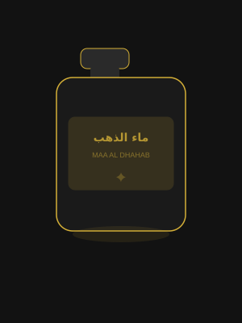

# ماء الذهب | Maa Al Dhahab Perfumes PWA
## عطور كويتية فاخرة من إبداع عبدالرحمن أبو الذهب



A complete, production-ready **Progressive Web App (PWA)** for the luxury Kuwaiti perfume brand **عطور ماء الذهب** (Maa Al Dhahab), built with:

- **ASP.NET Core 8 MVC** + Razor Views
- **Tailwind CSS** (CDN) + Vanilla JavaScript
- **Entity Framework Core** + SQL Server
- **Full PWA** support (offline, installable, push notifications)
- **RTL Arabic** primary + English toggle
- **Admin Dashboard** with full CRUD

---

## 🚀 Quick Start

### Prerequisites
- .NET 8 SDK
- SQL Server (LocalDB, Express, or Full)
- Node.js (optional, for Tailwind CLI)

### 1. Clone & Configure
```bash
cd MaaAlDhahab
# Edit connection string in appsettings.json
```

### 2. Update Connection String
Edit `MaaAlDhahab/appsettings.json`:
```json
{
  "ConnectionStrings": {
    "DefaultConnection": "Server=(localdb)\\mssqllocaldb;Database=MaaAlDhahabDB;Trusted_Connection=True;"
    // OR for SQL Server Express:
    // "DefaultConnection": "Server=.\\SQLEXPRESS;Database=MaaAlDhahabDB;Trusted_Connection=True;"
    // OR for full SQL Server:
    // "DefaultConnection": "Server=YOUR_SERVER;Database=MaaAlDhahabDB;User Id=sa;Password=YOUR_PASSWORD;"
  }
}
```

### 3. Run EF Migrations
```bash
cd MaaAlDhahab
dotnet tool install --global dotnet-ef
dotnet ef migrations add InitialCreate
dotnet ef database update
```

### 4. Run the Application
```bash
dotnet run
```

App will start at: `https://localhost:5001` or `http://localhost:5000`

Database is **auto-seeded** on first run with 12 products, categories, and admin user.

---

## 👤 Default Admin Credentials
| Field | Value |
|-------|-------|
| Email | `admin@maaAldhahab.com` |
| Password | `Admin@123456` |
| Admin Panel | `/admin` |

---

## 📁 Project Structure

```
MaaAlDhahab/
├── Areas/
│   └── Admin/
│       ├── Controllers/          # Admin CRUD controllers
│       └── Views/                # Admin panel views
│           ├── Dashboard/        # Analytics dashboard
│           ├── Products/         # Product management
│           ├── Orders/           # Order management
│           └── Promotions/       # Coupons & banners
├── Controllers/
│   ├── HomeController.cs         # Homepage, About, Contact
│   ├── ShopController.cs         # Product catalog + filters
│   ├── ProductController.cs      # Product detail + search
│   ├── CartController.cs         # Cart + wishlist management
│   ├── CheckoutController.cs     # Multi-step checkout
│   └── AccountController.cs     # Auth (login/register/profile)
├── Data/
│   ├── ApplicationDbContext.cs   # EF Core context
│   └── DbSeeder.cs               # Auto-seeds 12 products
├── Models/
│   ├── Product.cs                # Product entity
│   ├── Category.cs               # Category entity
│   ├── Order.cs + OrderItem.cs   # Order entities
│   ├── ApplicationUser.cs        # Identity user
│   ├── Promotion.cs              # Coupons, banners, reviews
│   └── ViewModels.cs             # All view models
├── Views/
│   ├── Shared/_Layout.cshtml     # Main layout (nav + footer)
│   ├── Home/Index.cshtml         # Luxury homepage
│   ├── Home/About.cshtml         # Brand story
│   ├── Shop/Index.cshtml         # Product catalog
│   ├── Product/Detail.cshtml     # Product detail + scent pyramid
│   ├── Cart/Index.cshtml         # Shopping cart
│   ├── Checkout/                 # Multi-step checkout
│   └── Account/                  # Auth views
└── wwwroot/
    ├── manifest.json             # PWA manifest
    ├── sw.js                     # Service Worker
    ├── css/luxury.css            # Custom luxury CSS
    ├── js/
    │   ├── app.js                # Main JS (nav, lang, particles)
    │   ├── cart.js               # Cart operations
    │   └── pwa.js                # PWA install prompt
    └── images/                   # Product images (placeholder included)
```

---

## ✨ Features

### 🏪 Store
- Mobile-first luxury design (Gold + Deep Black theme)
- RTL Arabic + English language toggle
- Advanced product filtering (gender, category, price range, sort)
- Scent pyramid visualization (Top/Middle/Base notes)
- Product size variants with price per size
- Customer reviews & ratings
- Wishlist (session-based)
- Related products

### 🛒 Cart & Checkout
- Session-based cart with server sync
- Real-time quantity updates
- Coupon/discount code system
- Kuwait address form (Governorate, Area, Block, Street)
- KNET + Cash on Delivery payment options
- Order confirmation with tracking number

### 📱 PWA
- Installable on Android & iOS
- Offline product browsing (service worker cache)
- Background sync for cart
- Push notification support
- Install prompt with custom UI
- Offline fallback page

### 👑 Admin Panel (`/admin`)
- Dashboard with KPIs (revenue, orders, products, customers)
- Full product CRUD with image URL support
- Order management with status updates
- Coupon/promotion creator with percentage or fixed amounts
- Banner management
- Marketing campaign creator UI

### 🎯 Marketing
- Flash sale prompts
- Coupon system (WELCOME20, GOLD2025)
- Newsletter subscription
- Loyalty points (50 points on registration)
- Referral code system
- Perfume personality quiz (Vanilla JS)
- SEO meta tags + Open Graph

---

## 🎨 Design System

| Color | Hex | Usage |
|-------|-----|-------|
| Gold | `#D4AF37` | Buttons, icons, highlights |
| Gold Light | `#F5E6B2` | Hover states |
| Gold Dark | `#C9A227` | Gradients |
| Luxury Black | `#0A0A0A` | Background |
| Card Black | `#121212` | Cards |
| Section | `#1A1A1A` | Sections |
| Border | `#2A2A2A` | Borders |

---

## 🛠️ Tech Stack

| Layer | Technology |
|-------|------------|
| Backend | ASP.NET Core 8 MVC |
| Frontend | Razor Views + Tailwind CSS + Vanilla JS |
| Database | SQL Server + EF Core 8 |
| Auth | ASP.NET Identity |
| PWA | Web App Manifest + Service Worker |
| Icons | Font Awesome 6 |
| Fonts | Cairo + Noto Sans Arabic |

---

## 📦 Adding Real Product Images

Place product images in `wwwroot/images/products/`:
- `abdulrahman.jpg`
- `bakhoor-dhahab.jpg`
- `almas.jpg`
- `alfahad.jpg`
- `volcano.jpg`
- etc.

Update image URLs in `DbSeeder.cs` or via the Admin Panel.

---

## 🔧 Tailwind CSS

Tailwind is loaded via CDN in `_Layout.cshtml`. For production:
```bash
npm install -D tailwindcss
npx tailwindcss init
npx tailwindcss -i ./wwwroot/css/input.css -o ./wwwroot/css/output.css --watch
```

---

## 📝 License

© 2025 ماء الذهب | Maa Al Dhahab Perfumes Kuwait
All rights reserved. Developed for عبدالرحمن أبو الذهب.
